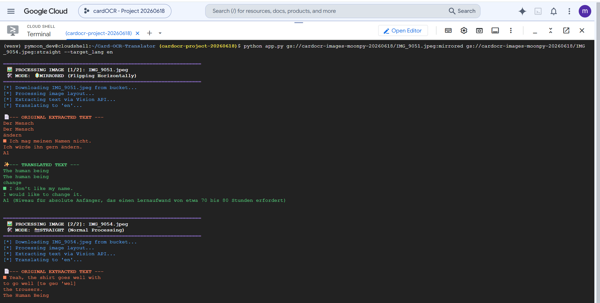

# 📸 Card OCR Translator (A11y)

## Technology Stack & Badges

## 📌 Project Overview
Digitizes and translates mirrored paper-based study cards. Corrects front-facing camera flipping, extracts text via Vision API, and translates using the Cloud Translation API pulling directly from Google Cloud Storage.

## © Copyright & Licensing
Created and maintained by **moonpy-a11y**. Released under the MIT License. Portions of the API interactions rely on Google Cloud Client Libraries (Licensed under Apache 2.0 by Google LLC).

## 💻 Application Output

